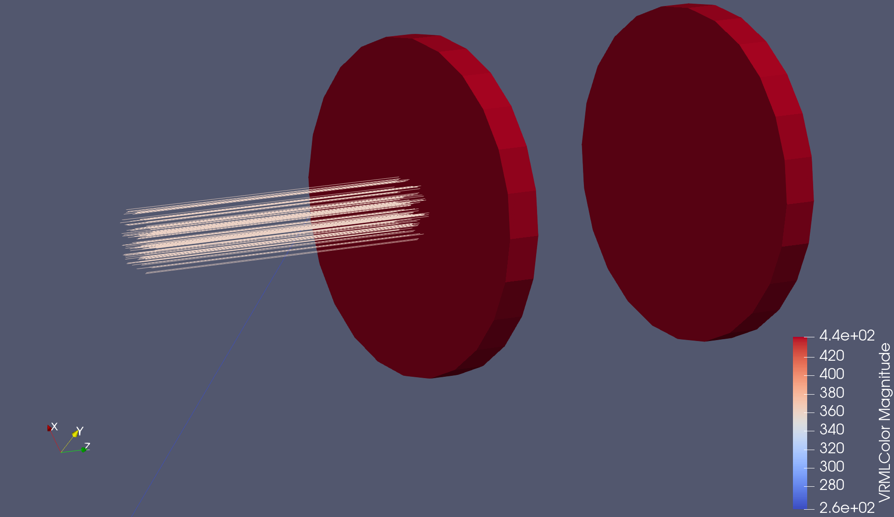
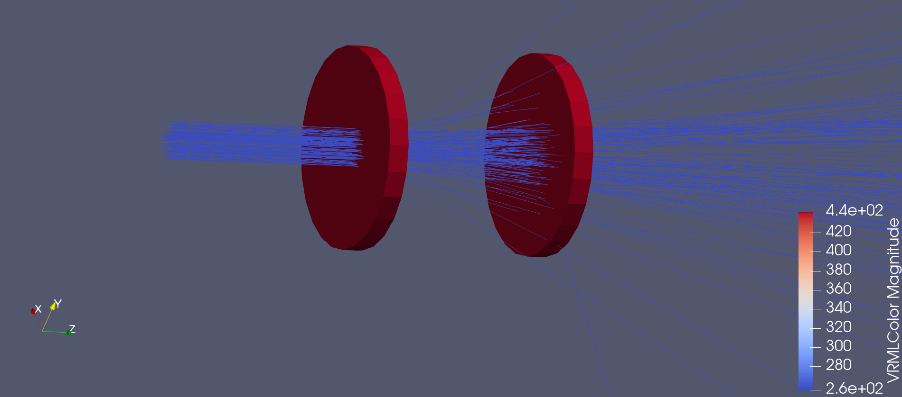

.. _examples:

Examples
======================

.. toctree::
    :numbered:
    :maxdepth: 3

This page shows some examples of a Grasshopper GDML input file.

Example Alpha Particle Energy Loss
----------------------------------

The world volume consists of Air at 1e-4 atm of pressure. The first red disk is Air at 1 atm and the second red disk is
the detector volume made of G4_Si.

Example Beta Particles in Water Transmission
--------------------------------------------

The world volume consists of Air at 1e-4 atm of pressure. The first red disk is G4_WATER and the second red disk is
the detector volume made of G4_Si.

Example Hand Calculations for 20 Situations
===========================================

5 particles, 2 shields, 2 energies

==  ================ ============== ==============
ID  Particle         Shield         Energy
==  ================ ============== ==============
01  Proton           Water 1cm      1 MeV
02  Proton           Water 1cm      10 MeV
03  Proton           G4_Fe 1cm      1 MeV
04  Proton           G4_Fe 1cm      10 MeV
05  Neutron          Water 1cm      1 MeV
06  Neutron          Water 1cm      10 MeV
07  Neutron          G4_Fe 1cm      1 MeV
08  Neutron          G4_Fe 1cm      10 MeV
09  Electron         0.5 Air 1cm    1 MeV
10  Electron         0.5 Air 1cm    10 MeV
11  Electron         1.0 Air 1cm    1 MeV
12  Electron         1.0 Air 1cm    10 MeV
13  Alpha            0.5 Air 1cm    1 MeV
14  Alpha            0.5 Air 1cm    10 MeV
15  Alpha            1.0 Air 1cm    1 MeV
16  Alpha            1.0 Air 1cm    10 MeV
17  Gamma            Water 1cm      1 MeV
18  Gamma            Water 1cm      10 MeV
19  Gamma            G4_Fe 1cm      1 MeV
20  Gamma            G4_Fe 1cm      10 MeV
==  ================ ============== ==============

Equations used
--------------

Transmission (Differential Cross Section):

:math:`I = I_0 e^{-\Sigma(E) x}`

Use tables,

Parameters:

- c: speed of light

- :math:`\epsilon_0`: Vacuum permittivity

- beta: the ratio of v to c

- e: electron charge

- m_e: electron mass

==  ================ ============== ============== ============== ==============
ID  Particle         Shield*        Energy         Stopping Power Transmission
==  ================ ============== ============== ============== ==============
01  Proton           Water 1cm      100 MeV        7.289e0 cm2/g  6.8e-4
02  Proton           Water 1cm      1 GeV          2.211e0 cm2/g  1.1e-1
03  Proton           G4_Fe 1cm      100 MeV
04  Proton           G4_Fe 1cm      1 GeV
05  Neutron          Water 1cm      1 MeV
06  Neutron          Water 1cm      10 MeV
07  Neutron          G4_Fe 1cm      1 MeV
08  Neutron          G4_Fe 1cm      10 MeV
09  Electron         0.5 Air 1cm    1 MeV
10  Electron         0.5 Air 1cm    10 MeV
11  Electron         1.0 Air 1cm    1 MeV
12  Electron         1.0 Air 1cm    10 MeV
13  Alpha            0.5 Air 1cm    1 MeV
14  Alpha            0.5 Air 1cm    10 MeV
15  Alpha            1.0 Air 1cm    1 MeV
16  Alpha            1.0 Air 1cm    10 MeV
17  Gamma            Water 1cm      1 MeV
18  Gamma            Water 1cm      10 MeV
19  Gamma            G4_Fe 1cm      1 MeV
20  Gamma            G4_Fe 1cm      10 MeV
==  ================ ============== ============== ============== ==============

* water is liquid state

Additionally the following formula could be used but is unnecessary for these high level estimates.

Energy Loss (Bethe Block Formula)

:math:`- <\dfrac{dE}{dx}> = \dfrac{4 \pi}{m_e c^2} \dfrac{n z^2}{\beta^2} (\dfrac{e^2}{4 \pi \epsilon_0})^2 [ln(\dfrac{2 m_e c^2 \beta^2}{I(1 - \beta^2)}) - \beta^2]`
